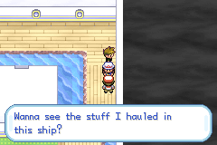
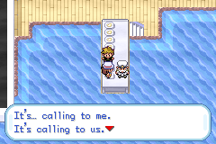

# FRLGV.IPS

> It's as you remember it...

This holds the repository for a ROM hack that includes a new rock by the water and the Trainer-fly glitch. (hence the name)

Sporadic updates, though I do hope to finish it maybe...

# Credits

- [Fire Red Overworld Sprite Resource](https://www.pokecommunity.com/threads/fire-red-overworld-sprite-resource.407124/)
- [Allistair's FRLG Style overworld tilesets](https://github.com/TeamAquasHideout/Team-Aquas-Asset-Repo/tree/main/Tilesets/Other%20Tilesets/Ewraz%20Collected%20Tilesets)
- [aveontrainer](https://www.deviantart.com/aveontrainer) (school tilesets)
- [Kalarie](https://github.com/TeamAquasHideout/Team-Aquas-Asset-Repo/tree/main/Trainer%20Front%20Sprites/Kalarie) (trainer sprites)
- Nullrot (trainer sprites)
